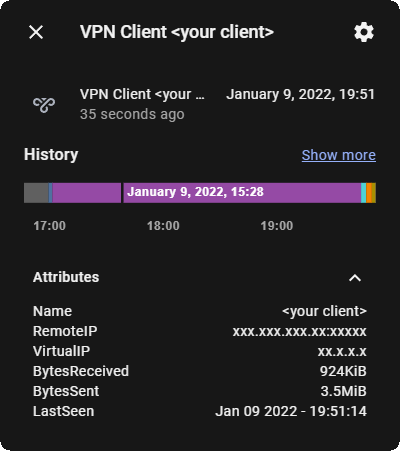

# PiVPN Clients Sensor

This script will run `pivpn -c` and parse the client data to individual sensors, formatted for HomeAssistant. MQTT Discovery is enabled so there is no need to configure mqtt sensors in your home assistant configuration. The sensor's state is configured as a timestamp while its attributes consist of the remaining info as shown below:



Clients that have `(not yet)` as `Last Seen` are skipped and the corresponding entities are automatically removed from Home Assistant if they exist.

## Install Dependencies
[requirements.txt](requirements.txt) contains the required packages. Run `pip3 install -r requirements.txt` to automatically install.

## Schedule a cron job
To save CPU effort, the script is written to run only once and then quit. It is advised to create a cron job to run this script on a schedule:

Run `crontab -e`
and add the following line to the file to run every 3 minutes 
``` 
*/3 * * * * python3 <path-to-vpnreport.py>
```
## Remove the cron job
Use `crontab -r` to remove entire crontab file (note there is only one file per user, so this will remove all cron jobs from the file) or use `crontab -e` to edit the cron job file and remove the corresponding line.